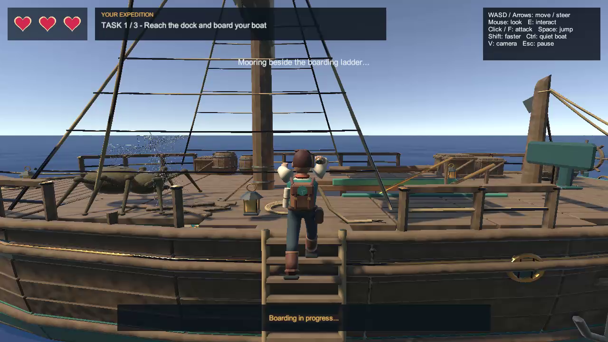
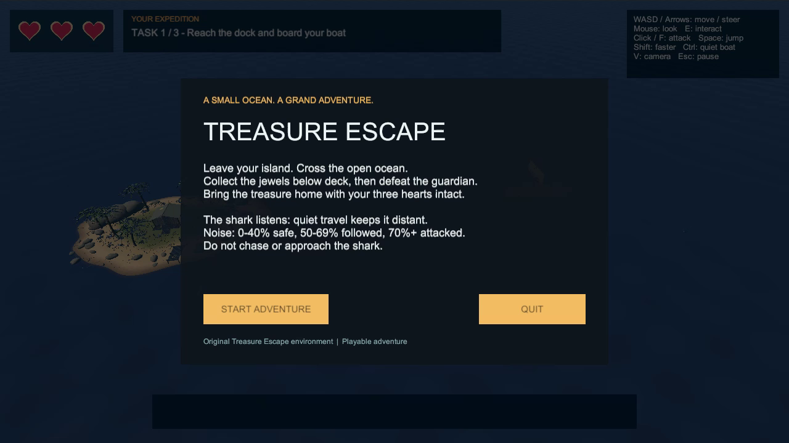
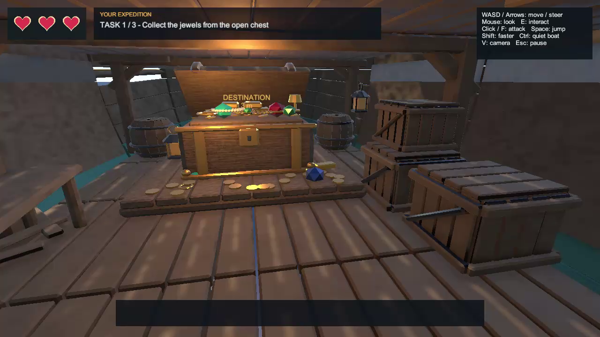
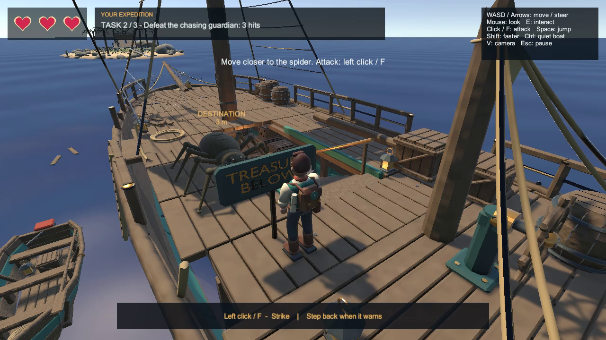

# Treasure Escape — Windows Game

A small ocean. A grand adventure.

Sail to a mysterious ship, recover the jewels hidden below deck, defeat the
spider guardian, and bring the treasure back to your island. Keep your boat
quiet and watch the shark as you cross the ocean.

**Windows 64-bit · Single-player · 3D adventure · English**

## Download and play

### [Download Treasure Escape for Windows](https://github.com/RitalALghates/TreasureEscape-Windows-Game/releases/latest/download/TreasureEscape_Windows.zip)

The complete game is available as **TreasureEscape_Windows.zip** on the
[Releases page](https://github.com/RitalALghates/TreasureEscape-Windows-Game/releases/latest).
The download is approximately **82 MB**.

1. Download **TreasureEscape_Windows.zip** using the link above.
2. Right-click the ZIP file and choose **Extract All**.
3. Open the extracted folder and double-click **TreasureEscape.exe**.
4. Select **START ADVENTURE** to begin.

Keep all extracted files and folders together, including **TreasureEscape_Data**,
**MonoBleedingEdge**, and the DLL files. Run the game from the extracted folder.
Unity and Blender are **not required** to play.

Use the Windows download above. GitHub's **Code → Download ZIP** button and the
automatically generated **Source code** links contain this repository's
documentation and screenshots, rather than the playable game.

## Your expedition

1. **Collect the treasure:** sail to the ship, climb aboard, and recover the
   jewels below deck.
2. **Defeat the guardian:** listen for the spider warning, return upstairs,
   and land three successful hits.
3. **Escape safely:** return to your boat, follow the escape route, and reach
   the island safe zone with at least one heart remaining.

You begin with three hearts. Loud boat movement attracts the shark, and getting
too close can provoke it even when your boat is quiet. Balance speed and noise
to survive the return journey.

## Controls

| Input | Action |
| --- | --- |
| WASD or Arrow keys | Walk / drive the boat |
| Mouse | Look around |
| E | Interact, board, disembark, climb, collect |
| Left click or F | Attack the spider |
| Shift | Sprint / boat boost |
| Ctrl | Quiet boat speed |
| Space | Jump |
| V | Change camera view |
| Esc | Pause / resume |

Use **QUIT** in the main menu or pause menu to close the game.

## Screenshots

### Main menu

### Treasure below deck

### Spider guardian

## Requirements and notes

- A **64-bit Windows** computer with a keyboard and mouse.
- A short adventure for **one player**, with an **English** interface.
- Progress is **not saved between sessions**.
- If the game cannot find a DLL or its Data folder, extract the entire ZIP
  again and keep the files in their original locations.

This repository distributes the compiled Windows game through Releases.
The editable Unity project, C# source files, and Blender project are not included.

The archive's SHA-256 checksum is recorded in [SHA256SUMS.txt](SHA256SUMS.txt).
